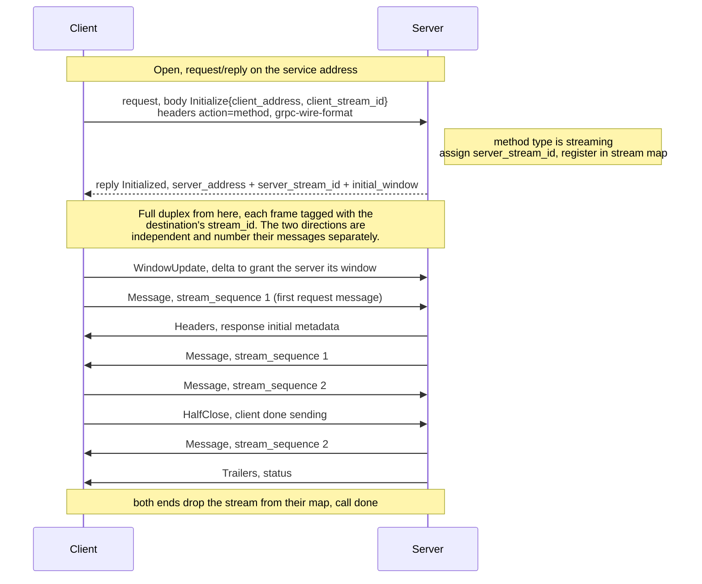

# vertx-grpc-eventbus (experimental)

This module is an experiment in carrying gRPC over the Vert.x event bus instead of
HTTP/2. It is early work, and the protocol sketched here is a proposal rather than
a settled format. The code in the module is a prototype that explores it. Both may
change, and the prototype does not necessarily match every detail below. Read this
as a design we are trying out, not as a specification to build against.

The motivation for trying it: when a client and server already share a Vert.x
application or cluster, it would be convenient to make gRPC calls (with the
generated stubs) over the event bus that is already there, without standing up an
HTTP server. That would also let the calls travel across a clustered event bus and
sit alongside the rest of the verticles.

## What we are aiming for

A goal of the design is that application code should not have to change. The
generated stubs and the `GrpcServerRequest` / `GrpcServerResponse` /
`GrpcClientRequest` types are shared with the HTTP/2 transport, so ideally only the
factory differs:

```java
// server
EventBusGrpcServer server = EventBusGrpcServer.server(vertx);
server.addService(GreeterGrpcService.of(new GreeterService() { ... }));

// client
EventBusGrpcClient client = EventBusGrpcClient.client(vertx);
GreeterClient greeter = GreeterGrpcClient.create(client);
greeter.sayHello(HelloRequest.newBuilder().setName("World").build());
```

The rest of this document is about what the wire would look like, because the event
bus is a message bus rather than a byte stream, and gRPC streaming needs some
protocol on top to bridge that gap.

## Two shapes of call

The proposal splits into two paths, chosen by the method's call type.

### Unary: plain request/reply

A unary call would be a single event bus `request()` and its reply. The method name
would go in the `action` header, the wire format in `grpc-wire-format`, request
metadata as `__header__.`-prefixed headers, and the body would be the encoded
message. The reply would carry the response message, with response metadata and
trailers as `__header__.` / `__trailer__.` headers.

This is the same shape a Vert.x service proxy uses, which is the point. Keeping
unary identical to a service-proxy call lets the two stay interchangeable on the
bus, so the proposal leaves unary as it is today and only adds the streaming path.

### Streaming: open and handshake

The event bus has no notion of a stream, so server-streaming, client-streaming and
bidirectional calls need more than request/reply. The client knows which it is
dealing with: the `ServiceMethod` carries the call type (its `type()`, filled in by
the generated stub), so it opens in the right shape without guessing.

For a streaming method the client sends an opening `request()` to the service
address. The opener is a pure handshake: its body is an `Initialize` carrying the
client's private address and the id it has assigned this stream. Triggering it on the
headers (rather than waiting for the first request message) lets the call register up
front, so a client that only sends headers, or one that wants to receive before it
sends, still opens the call. The server looks the method up, reads the same `type()`,
sets up the call and replies with an `Initialized` giving its own private address, the
id it has assigned this stream, and an initial window. The first request message then
follows as an ordinary `Message` frame once the call is streaming, the same as every
later one. The response initial metadata does not ride on the `Initialized` (which is
sent before the handler runs) but follows as a `Headers` frame ahead of the first response
message, so it reflects whatever the handler set. A unary method takes the
request/reply path above instead, with no extra addresses and no frames. Both sides
pick the same path because both read the same `type()` off the `ServiceMethod`, so
there is no negotiation or marker on the wire, and unary stays interchangeable with
a service proxy.

Once a call is open, frames flow over each endpoint's private address rather than a
per-call one. Each endpoint, a client or a server, mints a single private address at
startup and registers one consumer on it, and all of its streams are multiplexed over
that consumer. A frame carries the destination's `stream_id`, and the receiver
demuxes it to the right call through a map. Each endpoint assigns the
ids for its own inbound direction, so they can never collide on a shared address. The
open handshake is where the two endpoints swap the ids they have each assigned. Both
push frames at each other with fire-and-forget `send()`.

This matters most on a clustered bus. The service address is registered by every
server node, so the opening `request()` round-robins and lands on some node; the
private address in its `Initialized` is unique to that node, so every subsequent frame
for the stream pins to it. And because the consumer is long-lived and per-endpoint,
opening or closing a stream is just a map insert or remove, with no per-call consumer
register/unregister, which on a cluster would otherwise broadcast registration churn
to every node. A stream timeout, once added, would be a plain map removal too.

Ending a stream, by trailers or cancel, removes it from the map. A frame that arrives
for a `stream_id` no longer in the map (one still in flight when the stream was torn
down) is dropped. Closing an endpoint terminates its remaining streams rather than
dropping them silently: each is sent a `Cancel` so the peer is notified, then removed.



The handshake has to be careful about ordering. Neither side should start sending data until the
receiving consumer is actually registered, so the design waits for that
registration to complete first. The server's send window would also start at zero,
so it cannot send a response before the client has registered and granted it a
window. Together these would close a race where, on a local event bus, the whole
round trip can run synchronously before the application has even attached its
response handler.

## Frames

Everything after the opener would be a `TransportFrame`, serialized as protobuf
binary, so the event bus body is a plain `Buffer`. The full schema lives in
[`eventbus_transport.proto`](src/main/proto/io/vertx/grpc/eventbus/transport/v1alpha/eventbus_transport.proto) and is
reproduced here:

```proto
syntax = "proto3";

package io.vertx.grpc.eventbus.transport.v1alpha;

option java_package = "io.vertx.grpc.eventbus.transport.v1alpha";
option java_multiple_files = true;

// A frame exchanged over the event bus during a streaming gRPC call. Unary calls
// do not use these frames; they map to a plain request/reply. A streaming call
// opens with a request (its body an Initialize) whose reply is an Initialized. Each
// endpoint multiplexes all of its streams over a single private address, and
// stream_id demuxes the call on that address. Frames are serialized as protobuf
// binary. The handshake and flow control are described in the module README.
message TransportFrame {
  uint64 stream_id = 1; // the destination endpoint's id for this call, demuxes it on the shared private address
  uint64 stream_sequence = 2; // per-stream, monotonic, advances on Message frames only

  oneof frame {
    Initialize initialize = 3; // client to server, the opening request body
    Initialized initialized = 4; // server to client, the open reply
    Message message = 5; // a message payload, either direction
    WindowUpdate window_update = 6; // flow-control credit, either direction
    HalfClose half_close = 7; // client to server, end of the request stream
    Trailers trailers = 8; // server to client, terminates the call
    Cancel cancel = 9; // either direction, abnormal termination
    Headers headers = 10; // server to client, response metadata, before the first message
  }
}

// Client to server, the body of a streaming call's opening request. The server
// tags every server to client frame with client_stream_id.
message Initialize {
  string client_address = 1; // client's private address for server to client frames
  uint64 client_stream_id = 2; // the client's id for this call
}

// Server to client, the reply to a streaming call's opening request. The client
// tags every client to server frame with server_stream_id. Response initial
// metadata does not ride here; it follows as a Headers frame.
message Initialized {
  string server_address = 1; // server's private address for client to server frames
  uint64 server_stream_id = 3; // the server's id for this call
  uint32 initial_window = 2; // messages the server grants the client to send
}

// Server to client, response initial metadata, ordered ahead of the first response
// message. The metadata itself rides as __header__. prefixed delivery headers.
message Headers {
}

// A message payload, either direction. The serialized message in the call's wire
// format, carried verbatim.
message Message {
  bytes payload = 1;
}

// Flow-control credit, either direction: grants the peer delta more messages to
// send. Counted in messages, after HTTP/2's WINDOW_UPDATE.
message WindowUpdate {
  uint32 delta = 1;
}

// Client to server, end of the request stream (half close).
message HalfClose {
}

// Server to client, terminates the call. Trailing metadata rides as __trailer__.
// prefixed delivery headers.
message Trailers {
  uint32 status = 1; // gRPC status code
  string status_message = 2;
}

// Either direction, abnormal termination.
message Cancel {
  uint32 status = 1; // typically CANCELLED or DEADLINE_EXCEEDED
  string reason = 2;
}
```

One deliberate choice in the proposal is that the transport would not re-encode
messages. The gRPC encoder has already turned a request or response into bytes, so
the `Message.payload` field would just carry those bytes and the receiver would hand
them straight back to the decoder. There is no second codec in the middle and no
JSON-to-protobuf conversion. The envelope itself stays binary, so in JSON wire mode
the payload bytes inside would be native JSON while the wrapper around them would
not.

gRPC semantics that the encoder and decoder do not own would ride as event bus
delivery headers, mapped the same way for unary and streaming. The method would be
`action`, metadata would be `__header__.` / `__trailer__.` prefixed, and the wire
format would be `grpc-wire-format`. The frame protobuf would only carry what
streaming genuinely adds on top.

## Flow control

`send()` is fire-and-forget. It returns immediately whether or not the other side
is keeping up, so there is no built-in backpressure to lean on. The proposal is to
carry a window of our own, counted in messages rather than bytes.

The idea is borrowed from HTTP/2's `WINDOW_UPDATE` (RFC 7540, section 6.9), applied
at the message level. Each side would start with the window its peer granted in the
handshake and spend one credit per `Message` it sends, stopping at zero. As the
receiving application consumes messages, the receiver would send a
`WindowUpdate{delta}` back, and the sender would add the delta to its window. The
intent is to express this through the Vert.x `WriteStream` contract. A zero window
makes `writeQueueFull()` return true, and an arriving `WindowUpdate` fires the
`drainHandler`, so a generated `Pipe` or any well-behaved producer would behave the
way it does over HTTP/2.

A producer that ignores `writeQueueFull()`, for example a tight loop of
`response.write(...)`, would still need to be safe. The plan is for the stream to
buffer the extra messages once the window is spent and to hold back the terminating
frame until they drain, so nothing is lost or reordered.

On a local event bus this would also give real backpressure, because a paused
consumer would otherwise just buffer and eventually drop. On a clustered event bus
the window would be the only thing pushing back at all, since a `send()` is already
on the wire the moment it is issued.

Multiplexing makes the per-stream window the only backpressure available. Because
every stream on an endpoint shares one consumer, that consumer is never paused, since
pausing it would stall every stream behind a slow one (head-of-line blocking). A slow
reader pushes back only by withholding `WindowUpdate` credit on its own stream, while
the shared consumer keeps draining the others.

## Open questions and future work

This is an experiment, and several pieces are deliberately out of scope for now.
These are the directions they would take.

- **Session identity and resumption.** Streams are already multiplexed over one
  long-lived private consumer per endpoint and told apart by `stream_id`, so there
  is no per-call registration churn. The private address doubles as the endpoint's
  session token: it is minted per process and dies with it, so a restarted endpoint
  has a new address and stale frames hit a dead one. A distinct, stable `session_id`
  would only be needed to tie streams across a reconnect (resumption, below) or for
  session-level flow control; it is deferred until then.

- **Session-level flow control.** HTTP/2 has a second, connection-wide window on top
  of the per-stream one, so a connection can cap total buffering across its streams.
  The analog would be a session-wide window across all streams sharing an endpoint's
  private address, which pairs with the `session_id` above.

- **Resumption.** The `stream_sequence` on each `Message` is there to leave room for
  a dropped client to reconnect and ask the server to replay everything after the last
  sequence it saw, in the spirit of MCP's `Last-Event-ID` resumption. The reconnect
  handshake and a bounded replay buffer would be the missing pieces. Surviving a
  node failure rather than just a dropped connection would additionally want the
  session state in a shared or durable store, which could be an SPI with a local
  default and, for example, a Redis backend.

- **Readable JSON envelope.** In JSON wire mode the payload would be native JSON but
  the frame wrapping it would be binary, so the bus body would not be readable end
  to end. Encoding the envelope itself as JSON in JSON mode would fix that, at the
  cost of a payload codec the proposal currently avoids.

## References

- **RFC 7540**, *Hypertext Transfer Protocol Version 2 (HTTP/2)*, sections 5.2 and
  6.9, covering flow control and `WINDOW_UPDATE`. This is the model for the
  message-counted window proposed here. It was obsoleted by **RFC 9113**, which
  keeps the same flow control.
- **gRPC over HTTP/2**, the gRPC wire protocol this proposal mirrors at the call
  level: <https://github.com/grpc/grpc/blob/master/doc/PROTOCOL-HTTP2.md>
- **Model Context Protocol, Streamable HTTP transport**, the source of the session
  and `Last-Event-ID` resumption ideas in the future work above:
  <https://modelcontextprotocol.io/specification>
- **Reactive Streams**, the demand-signalling model (`request(n)`) that Vert.x's own
  `ReadStream.fetch` and this window scheme both follow:
  <https://www.reactive-streams.org/>
- **RSocket**, a message-oriented protocol whose `REQUEST_N` frame is close prior
  art for message-counted flow control: <https://rsocket.io/about/protocol>
