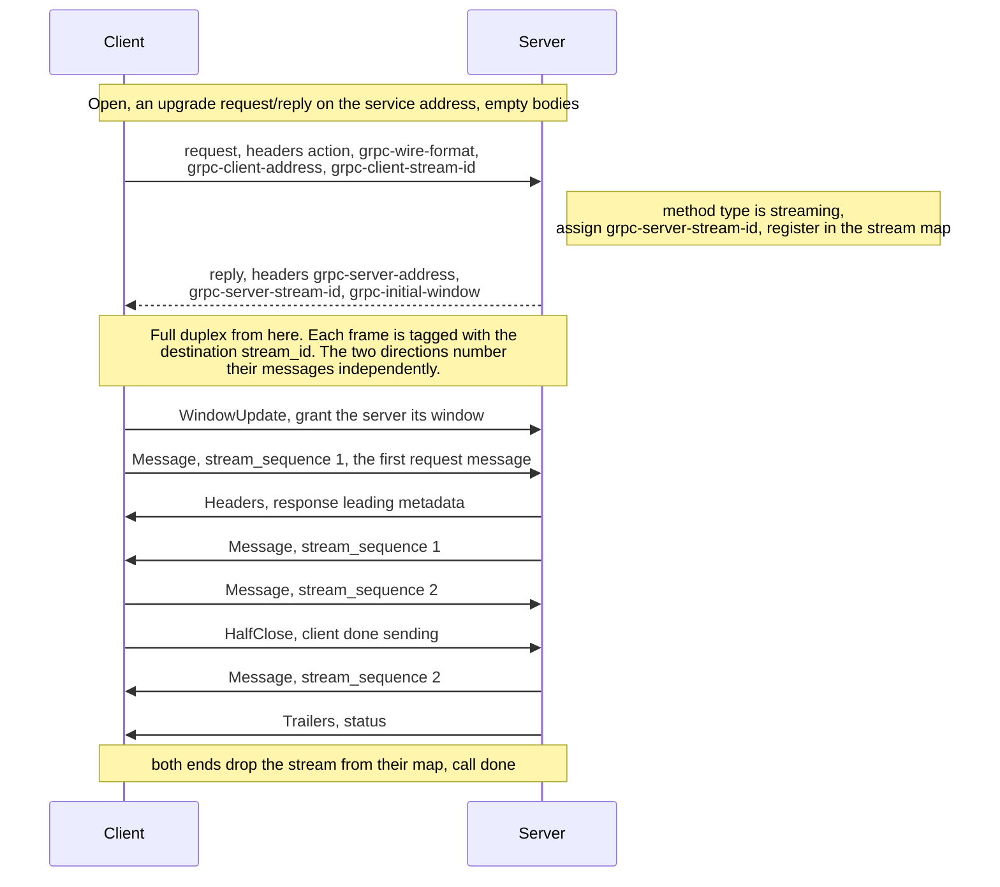

# vertx-grpc-eventbus (experimental)

This module is an experiment in carrying gRPC over the Vert.x event bus instead of
HTTP/2. It is early work. The protocol below is a proposal we are trying out, not a
settled format, and the prototype will not always match every detail. Read it as a
design in progress, not a specification to build against.

Why try it? When a client and server already live in the same Vert.x application or
cluster, it is convenient to make gRPC calls with the generated stubs over the event
bus that is already there, without standing up an HTTP server. The calls can then
travel across a clustered event bus and sit alongside the rest of the verticles.

## What we are aiming for

Application code should not have to change. The generated stubs and the
`GrpcServerRequest`, `GrpcServerResponse` and `GrpcClientRequest` types are shared with
the HTTP/2 transport, so ideally only the factory differs.

```java
// server
EventBusGrpcServer.server(vertx).onSuccess(server -> {
  server.addService(GreeterGrpcService.of(new GreeterService() { ... }));
});

// client
EventBusGrpcClient.client(vertx).onSuccess(client -> {
  GreeterClient greeter = GreeterGrpcClient.create(client);
  greeter.sayHello(HelloRequest.newBuilder().setName("World").build());
});
```

The rest of this document is about what the wire looks like. The event bus is a
message bus rather than a byte stream, so gRPC streaming needs a little protocol on top
to bridge the gap.

## Two shapes of call

The design splits in two, chosen by the method's call type.

### Unary: plain request/reply

A unary call is a single event bus `request()` and its reply. The method name goes in
the `action` header, the wire format in `grpc-wire-format`, request metadata as
`__header__.` prefixed headers, and the body is the encoded message. The reply carries
the response message, with response metadata and trailers as `__header__.` and
`__trailer__.` headers.

This is the same shape a Vert.x service proxy uses, which is the point. Keeping unary
identical to a service-proxy call lets the two stay interchangeable on the bus. So
unary is left as it is, and only streaming adds anything new.

### Streaming: an upgrade handshake

The event bus has no notion of a stream, so server-streaming, client-streaming and
bidirectional calls need more than a single request/reply. The client always knows
which kind it is making. The `ServiceMethod` carries the call `type()`, filled in by
the generated stub, so it opens in the right shape without guessing, and the server
reads the same `type()` and agrees. There is no negotiation or marker on the wire.

Opening a stream is an HTTP upgrade style request/reply, carried in delivery headers the
same way unary is, with an empty body on each side.

The client sends the opening `request()` to the service address. The headers carry
`action` (the method), `grpc-wire-format`, the client's private `grpc-client-address`,
and the `grpc-client-stream-id` it has assigned this call, plus any request metadata as
`__header__.` headers. Triggering the open on the request headers, rather than waiting
for the first message, lets a call that only sends headers, or one that wants to receive
before it sends, still open.

The server replies. It looks the method up, sets the call up, registers it, and answers
with its own `grpc-server-address`, the `grpc-server-stream-id` it has assigned, and a
`grpc-initial-window`. The reply is the "go" signal and nothing more. It is sent before
the handler runs, so it carries no response metadata.

From there the call is full duplex, and everything travels as a `TransportFrame` over
the two private addresses. The first request message follows as an ordinary `Message`
frame, the same as every later one. Response leading metadata follows as a `Headers`
frame ahead of the first response message, so it reflects whatever the handler set.

A unary method skips all of this and takes the request/reply path above, so it stays
interchangeable with a service proxy.

Once open, frames flow over each endpoint's private address, not a per-call one. Every
endpoint, client or server, mints one private address at startup, registers a single
long-lived consumer on it, and multiplexes all of its streams through that one consumer.
Each frame carries the destination's `stream_id`, and the receiver demuxes it back to
the right call through a map. Each endpoint assigns the ids for its own inbound
direction, so two endpoints can never pick colliding ids on a shared address. The
handshake is where they swap the ids they have each chosen. Both sides push frames with
fire-and-forget `send()`.

This matters most on a clustered bus. The service address is registered by every server
node, so the opening `request()` round-robins and lands on some node. The private
address in its reply is unique to that node, so every subsequent frame for the stream
pins to it. And because the consumer is long-lived and per-endpoint, opening or closing
a stream is just a map insert or remove. There is no per-call consumer register and
unregister, which on a cluster would otherwise broadcast registration churn to every
node. A stream timeout, once added, would be a plain map removal too.

Ending a stream, by trailers or cancel, removes it from the map. A frame that arrives for
a `stream_id` no longer in the map, one still in flight when the stream was torn down, is
dropped. Closing an endpoint terminates its remaining streams rather than dropping them
silently. Each is sent a `Cancel` so the peer is notified, then removed.



The handshake is careful about ordering. Neither side starts sending data until the
receiving consumer is actually registered, so the design waits for that registration to
complete first. The server's send window also starts at zero, so it cannot send a
response before the client has registered and granted it a window. Together these close
a race where, on a local event bus, the whole round trip could otherwise run
synchronously before the application has even attached its response handler.

## Frames

Everything after the handshake is a `TransportFrame`. The envelope is encoded in the
call's wire format, protobuf binary by default or JSON when the call runs in JSON mode,
and travels as the event bus body. The format is named in the frame's `grpc-wire-format`
header so the receiver knows how to read it.

A frame is a small header, `stream_id` and `stream_sequence`, plus exactly one variant.
The variant is a `Message` payload, a `WindowUpdate` flow-control credit, a `HalfClose`
from the client, a server `Headers` or `Trailers`, or a `Cancel` from either side.

`Headers` and `Trailers` are thin. The metadata itself rides as `__header__.` and
`__trailer__.` delivery headers, and these frames only mark where in the stream that
metadata belongs. `Trailers` also carries the gRPC `status`, because the response stream
must end with one. The full schema lives in
[`eventbus_transport.proto`](src/main/proto/io/vertx/grpc/eventbus/transport/v1alpha/eventbus_transport.proto)
and reads:

```proto
syntax = "proto3";

package io.vertx.grpc.eventbus.transport.v1alpha;

option java_package = "io.vertx.grpc.eventbus.transport.v1alpha";
option java_multiple_files = true;

message TransportFrame {
  uint64 stream_id = 1;       // destination endpoint's id for this call, demuxes it on the shared address
  uint64 stream_sequence = 2; // per-stream, monotonic, advances on Message frames only

  oneof frame {
    Message message = 3;            // a message payload, either direction
    WindowUpdate window_update = 4; // flow-control credit, either direction
    HalfClose half_close = 5;       // client to server, end of the request stream
    Trailers trailers = 6;          // server to client, terminates the call
    Cancel cancel = 7;              // either direction, abnormal termination
    Headers headers = 8;            // server to client, response metadata, before the first message
  }
}

// Server to client, response initial metadata, ordered ahead of the first response
// message. The metadata itself rides as __header__. prefixed delivery headers.
message Headers {
}

// A message payload, either direction. The serialized message in the call's wire
// format, carried verbatim.
message Message {
  bytes payload = 1;
}

// Flow-control credit, either direction: grants the peer delta more messages to
// send. Counted in messages, after HTTP/2's WINDOW_UPDATE.
message WindowUpdate {
  uint32 delta = 1;
}

// Client to server, end of the request stream (half close).
message HalfClose {
}

// Server to client, terminates the call. Trailing metadata rides as __trailer__.
// prefixed delivery headers.
message Trailers {
  uint32 status = 1; // gRPC status code
  string status_message = 2;
}

// Either direction, abnormal termination.
message Cancel {
  uint32 status = 1; // typically CANCELLED or DEADLINE_EXCEEDED
  string reason = 2;
}
```

The transport never re-encodes messages. The gRPC encoder has already produced the
bytes, so `Message.payload` carries them verbatim and the receiver hands them straight
back to the decoder. There is no second codec in the middle. The envelope does follow
the call's wire format. In protobuf mode it is binary. In JSON mode the frame is a JSON
object, so its shape is readable on the bus, which is handy with an event bus
interceptor, for example to watch frames or drop one and test how the call reacts. The
payload inside a JSON frame is still the opaque message bytes, carried as base64 rather
than re-encoded.

gRPC semantics that the encoder and decoder do not own ride as event bus delivery
headers, mapped the same way for unary and streaming. The method is `action`, metadata
is `__header__.` and `__trailer__.` prefixed, and the wire format is `grpc-wire-format`.
The frame protobuf only carries what streaming genuinely adds on top.

## Configuration

Both ends take an options object. Both are optional and default to sensible values.

```java
EventBusGrpcServer.server(vertx, new EventBusGrpcServerOptions()
  .setMaxConcurrentStreams(500)
  .setSupportedWireFormats(EnumSet.of(WireFormat.PROTOBUF)));

EventBusGrpcClient.client(vertx, new EventBusGrpcClientOptions()
  .setWireFormat(WireFormat.JSON));
```

- `maxConcurrentStreams` (server, default `1000`) caps the streams one server
  multiplexes at once. An open past the cap is rejected with `RESOURCE_EXHAUSTED`, so a
  flood of opens cannot grow the demux map without bound.
- `supportedWireFormats` (server, default `[PROTOBUF, JSON]`) limits which wire formats
  the server accepts. A request in an unsupported format is rejected with
  `UNIMPLEMENTED`.
- `wireFormat` (client, default `PROTOBUF`) is the default wire format for the client's
  requests. A call can still override it with `request.format(...)`, and the generated
  stubs' `create(client, WireFormat.JSON)` does exactly that. The override wins.

## Flow control

`send()` is fire-and-forget. It returns immediately whether or not the other side is
keeping up, so there is no built-in backpressure to lean on. The design carries a window
of its own, counted in messages rather than bytes.

The idea is borrowed from HTTP/2's `WINDOW_UPDATE` (RFC 7540, section 6.9), applied at
the message level. Each side starts with the window its peer granted in the handshake
and spends one credit per `Message` it sends, stopping at zero. As the receiving
application consumes messages, the receiver sends a `WindowUpdate` back with a delta, and
the sender adds it to its window. This is expressed through the Vert.x `WriteStream`
contract. A zero window makes `writeQueueFull()` return true, and an arriving
`WindowUpdate` fires the `drainHandler`, so a generated `Pipe` or any well-behaved
producer behaves the way it does over HTTP/2.

A producer that ignores `writeQueueFull()`, such as a tight loop of `response.write(...)`,
still has to be safe. The stream buffers the extra messages once the window is spent and
holds back the terminating frame until they drain, so nothing is lost or reordered.

On a local event bus this gives real backpressure, because a paused consumer would
otherwise just buffer and eventually drop. On a clustered event bus the window is the
only thing pushing back at all, since a `send()` is already on the wire the moment it is
issued.

Multiplexing makes the per-stream window the only backpressure available. Because every
stream on an endpoint shares one consumer, that consumer is never paused. Pausing it
would stall every stream behind a slow one, which is head-of-line blocking. A slow reader
pushes back only by withholding `WindowUpdate` credit on its own stream, while the shared
consumer keeps draining the others.

## Open questions and future work

This is an experiment, and several pieces are deliberately out of scope for now. These
are the directions they would take.

- Session identity and resumption. Streams are already multiplexed over one long-lived
  private consumer per endpoint and told apart by `stream_id`, so there is no per-call
  registration churn. The private address doubles as the endpoint's session token. It is
  minted per process and dies with it, so a restarted endpoint has a new address and
  stale frames hit a dead one. A distinct, stable `session_id` would only be needed to
  tie streams across a reconnect, or for session-level flow control, and is deferred
  until then.
- Session-level flow control. HTTP/2 has a second, connection-wide window on top of the
  per-stream one, so a connection can cap total buffering across its streams. The analog
  would be a session-wide window across all streams sharing an endpoint's private
  address, which pairs with the `session_id` above.
- Resumption. The `stream_sequence` on each `Message` is there to leave room for a
  dropped client to reconnect and ask the server to replay everything after the last
  sequence it saw, in the spirit of MCP's `Last-Event-ID` resumption. The reconnect
  handshake and a bounded replay buffer would be the missing pieces. Surviving a node
  failure rather than just a dropped connection would additionally want the session state
  in a shared or durable store, which could be an SPI with a local default and, for
  example, a Redis backend.

## References

- RFC 7540, Hypertext Transfer Protocol Version 2 (HTTP/2), sections 5.2 and 6.9,
  covering flow control and `WINDOW_UPDATE`. This is the model for the message-counted
  window used here. It was obsoleted by RFC 9113, which keeps the same flow control.
- gRPC over HTTP/2, the gRPC wire protocol this design mirrors at the call level:
  <https://github.com/grpc/grpc/blob/master/doc/PROTOCOL-HTTP2.md>
- Model Context Protocol, Streamable HTTP transport, the source of the session and
  `Last-Event-ID` resumption ideas in the future work above:
  <https://modelcontextprotocol.io/specification>
- Reactive Streams, the demand-signalling model (`request(n)`) that Vert.x's own
  `ReadStream.fetch` and this window scheme both follow:
  <https://www.reactive-streams.org/>
- RSocket, a message-oriented protocol whose `REQUEST_N` frame is close prior art for
  message-counted flow control: <https://rsocket.io/about/protocol>
