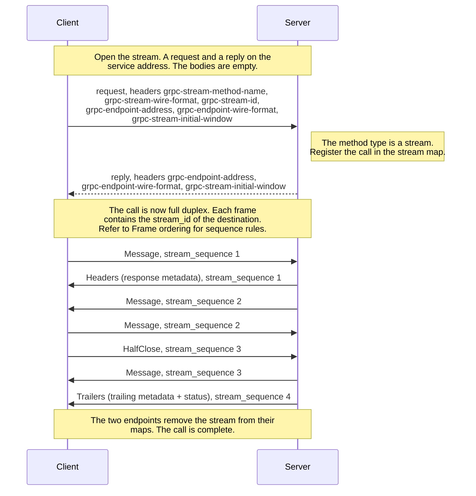

# vertx-grpc-eventbus (experimental)

This module uses the Vert.x event bus as a transport for gRPC services.

## Goals

Implement a transport over the Vert.x event-bus:

```java
// server
EventBusGrpcServer.server(vertx).onSuccess(server -> {
  server.addService(GreeterGrpcService.of(new GreeterService() { ... }));
});

// client
EventBusGrpcClient.client(vertx).onSuccess(client -> {
  GreeterClient greeter = GreeterGrpcClient.create(client);
  greeter.sayHello(HelloRequest.newBuilder().setName("World").build());
});
```

## Remote procedure calls

### Unary calls

Unary calls use the request/reply pattern.

The request contains the following message headers:

- `grpc-stream-method-name`, the name of the method.
- `grpc-stream-wire-format`, the wire format.
- `grpc-stream-id`, the stream identifier.
- headers prefixed by `grpc-stream-header.` form the request metadata
- the body contains the encoded message

The reply contains the response message:

- message headers prefixed by `grpc-stream-header.` form the response metadata
- message headers prefixed by `grpc-stream-trailer.` form the trailers
- a status `OK` response translates into a message reply
- otherwise the server fails the response with the gRPC status as the failure code and the status message as the failure message

### Streaming calls

The event bus does not natively support streaming, instead any kind of streaming requires more than one request and one reply.

To open a stream, the client sends a request and receives a reply.

#### Topology

Each endpoints registers an endpoint consumer with a unique identifier as address, this is called the endpoint address, it
is sent to its peers when streaming is involved. This endpoint unidirectional channel carries transport frames for various needs.

When a client calls a server and streaming is involved, the sides needing to receive frames will send their endpoint address in the
initial request/reply.

On a cluster, this lets the event bus perform an initial load balancing to locate a service, when an endpoint is designed for the service method call, the endpoint address ensures that the messages are efficiently routed to the endpoint address. As the endpoint address is registered at the creation of the endpoint, this ensures maximum stability.

#### The request

The request contains the following message headers:

- `grpc-stream-method-name`, the name of the method
- `grpc-stream-wire-format`, the wire format
- `grpc-stream-id`, the identifier that the client gives to this call
- `grpc-endpoint-address`, the private address of the client, present when the client is streaming
- `grpc-endpoint-wire-format`, the wire format of the client when the client is streaming
- `grpc-stream-initial-window`, the initial flow control window when the server is streaming, see [Flow control](#flow-control).
- `grpc-endpoint-ping-timeout`, the time in milliseconds that the client waits before it declares a peer down, refer to [Liveness](#liveness).
- headers prefixed by `grpc-stream-header.` form the request metadata

The request body depends on the client method cardinality:

- when the client sends a unique message, the request body is this unique message
- when the client sends a stream of messages, the request body is null, the client expects a reply with the server address

The server deduces the communication pattern from the request:

- a null body means the client will stream
- presence of `grpc-endpoint-address` / `grpc-endpoint-wire-format` / `grpc-stream-initial-window` indicates the server can stream

#### The reply

The server follows these steps:

1. resolves the service method
2. deduces the communication pattern from the request.
3. sends a reply

The reply contains the following message headers:

- `grpc-endpoint-address`, the private address of the server, present when the server is streaming
- `grpc-endpoint-wire-format`, the wire format of the server when the client is streaming
- `grpc-stream-initial-window`, the initial flow control window when the client is streaming, see [Flow control](#flow-control).

The reply body is always null.

#### Endpoint addresses and multiplexing

When an endpoint is created, it binds a consumer to a unique endpoint address.

The endpoint address is used

- by endpoints to exchange ping frames
- by streams, the stream id is indicated in each message as a header `grpc-stream-id`

A stream identifier is a 64-bit value that uniquely identifies a stream.

#### End of a stream

The endpoint disposes a stream when

- it receives the last frame of a stream
- it receives a stream cancellation frame
- it receives an out of order frame, see [Frame ordering](#frame-ordering).

When you close an endpoint, the endpoint stops the active streams by sending a cancel frame for each stream.


```mermaid
sequenceDiagram
    participant C as Client
    participant S as Server

    Note over C,S: Open the stream. A request and a reply on the<br/>service address. The bodies are empty.
    C->>S: request, headers grpc-stream-method-name,<br/>grpc-stream-wire-format, grpc-stream-id,<br/>grpc-endpoint-address, grpc-endpoint-wire-format,<br/>grpc-stream-initial-window
    Note right of S: The method type is a stream.<br/>Register the call in the stream map.
    S-->>C: reply, headers grpc-endpoint-address,<br/>grpc-endpoint-wire-format, grpc-stream-initial-window

    Note over C,S: The call is now full duplex. Each frame<br/>contains the stream_id of the destination.<br/>Refer to Frame ordering for sequence rules.
    C->>S: Message, stream_sequence 1
    S->>C: Headers (response metadata), stream_sequence 1
    S->>C: Message, stream_sequence 2
    C->>S: Message, stream_sequence 2
    C->>S: HalfClose, stream_sequence 3
    S->>C: Message, stream_sequence 3
    S->>C: Trailers (trailing metadata + status), stream_sequence 4
    Note over C,S: The two endpoints remove the stream from their<br/>maps. The call is complete.
```

## Frames

The event bus protocol uses a frame per event bus message: endpoints send event bus message to other endpoints
with a frame body.

Each endpoint advertises the wire format it expects to receive: the default format is protobuf binary, JSON can be used
as alternative.

A frame contains a small header and one variant. The header contains the `stream_id` and
`stream_sequence` values. The variant is one of these items:

- `Message`, a payload.
- `WindowUpdate`, a flow control credit.
- `HalfClose`, from the client.
- `Headers`, response metadata from the server. The metadata is carried inside the frame as a `map<string, string>`.
- `Trailers`, trailing metadata with gRPC status from the server. The metadata is carried inside the frame as a `map<string, string>`.
- `Cancel`, from the client or from the server.
- `Ping`, a liveness probe, from the client or from the server.

### Frame ordering

Content frames — `Message`, `Headers`, `Trailers`, and `HalfClose` — carry an
incrementing `stream_sequence` value. Each direction counts independently, starting from
`1`. Control frames (`WindowUpdate`) carry `stream_sequence` `0` and are not sequenced.

The endpoint tracks the expected sequence for each stream, when a content frame arrives
with a `stream_sequence` that does not match the expected value, the receiver cancels the
stream and sends a `Cancel` frame to the sender. This condition indicates that a frame was
lost or reordered in transit, which can happen with event bus interceptors: implementors of
event-bus interceptors must preserve the frame ordering per stream.

The full schema is in
[`eventbus_transport.proto`](src/main/proto/io/vertx/grpc/eventbus/transport/v1alpha/eventbus_transport.proto):

Transport frames are sent as is on the event bus, since they are immutable java objects. They are only
encoded and decoded on a clustered event bus to Protobuf or JSON depending on the endpoint wire format configuration.
The gRPC event bus therefore register event bus message codec to implement this.

## Configuration

The server and the client can be configured:

```java
EventBusGrpcServer.server(vertx, new EventBusGrpcServerOptions()
  .setWireFormat(WireFormat.PROTOBUF));

EventBusGrpcClient.client(vertx, new EventBusGrpcClientOptions()
  .setWireFormat(WireFormat.JSON)
  .setPingInterval(Duration.ofSeconds(30)));
```

## Flow control

The event bus implements per stream flow control using a credit mechanism, very much like HTTP/2 does.

Both sides of the stream exchange their inbound window in the handshake when needed. The client
sends `grpc-stream-initial-window` in the request when the server streams, and the server
sends `grpc-stream-initial-window` in the reply when the client streams. Each side uses the
window of the peer as its send credit. Credit is per message, at zero credits, sending stops.

## Liveness

The gRPC event bus implements liveness.

### Message delivery failure

Each endpoint sends the frames to the private address of its peers. A point-to-point
`send()` call fails with `NO_HANDLERS` when that address has no consumer.

When this happens, the recipient endpoint is evicted.

### Ping frames

Client endpoints are configured to ping their remote server peers at regular intervals. When an endpoint
receives a ping, it replies immediately with an acknowledgement of the ping.

At regular intervals, endpoints for which no ping or ack has been received are evicted.

NOTE: Unary calls are request/reply and do not trigger peer monitoring.

## Service proxy compatibility

The protocol has been designed with Vert.x service proxies in mind: unary calls are compatible
with the service proxies protocol when the RPC calls use JSON.

The service proxies protocol relies on the `action` request message header and therefore
the client will also send an `action` header when the RPC uses JSON and the server
will accept requests carrying the `action` header.

## Open questions and future work

This module is an experiment. Some functions are not in the current scope. This is the
direction for each function.

- **Session identity and resumption.** The endpoint multiplexes the streams on one
  consumer that stays registered, and the `stream_id` value identifies each stream.
  Therefore there is no registration data for each call. The private address is also the
  session token of the endpoint. The endpoint creates this address for each process, and
  the address stops with the process. Therefore an endpoint that starts again has a new
  address, and old frames go to an address that has no consumer. A different, permanent
  `session_id` value is necessary only for two functions: to connect the streams after a
  new connection, and for flow control at session level. This work is deferred.
- **Flow control at session level.** HTTP/2 has a second window for the full connection,
  in addition to the window of each stream. Therefore a connection can limit the total
  quantity of data in its buffers. The equivalent function is a window for all the streams
  that use one private address. This function needs the `session_id` value above.
- **Resumption.** Each content frame contains a `stream_sequence` value. The sequence
  currently detects out-of-order delivery. It also permits a future resumption function. A
  client that loses its connection can connect again. The client can then ask the server to
  send again all the messages after the last sequence value that it received. The MCP `Last-Event-ID` function has the same purpose. Two items
  are necessary: a handshake for the new connection, and a replay buffer with a limit. To
  continue after a node failure, and not only after a lost connection, the session data
  must be in a shared or permanent store. This store can be an SPI with a local default
  and, for example, a Redis backend.

## References

- RFC 7540, Hypertext Transfer Protocol Version 2 (HTTP/2), sections 5.2 and 6.9. These
  sections give flow control and the `WINDOW_UPDATE` frame. This is the model for the
  window in this design, which counts messages. RFC 9113 replaces RFC 7540 and keeps the
  same flow control.
- gRPC on HTTP/2, the gRPC wire protocol. This design follows that protocol at call level:
  <https://github.com/grpc/grpc/blob/master/doc/PROTOCOL-HTTP2.md>
- Model Context Protocol, Streamable HTTP transport. This is the source of the session and
  `Last-Event-ID` ideas in the section above:
  <https://modelcontextprotocol.io/specification>
- Reactive Streams, the model that uses `request(n)` to signal demand. The Vert.x
  `ReadStream.fetch` method and this window both follow that model:
  <https://www.reactive-streams.org/>
- RSocket, a protocol for messages. Its `REQUEST_N` frame is comparable prior art for flow
  control that counts messages: <https://rsocket.io/about/protocol>
