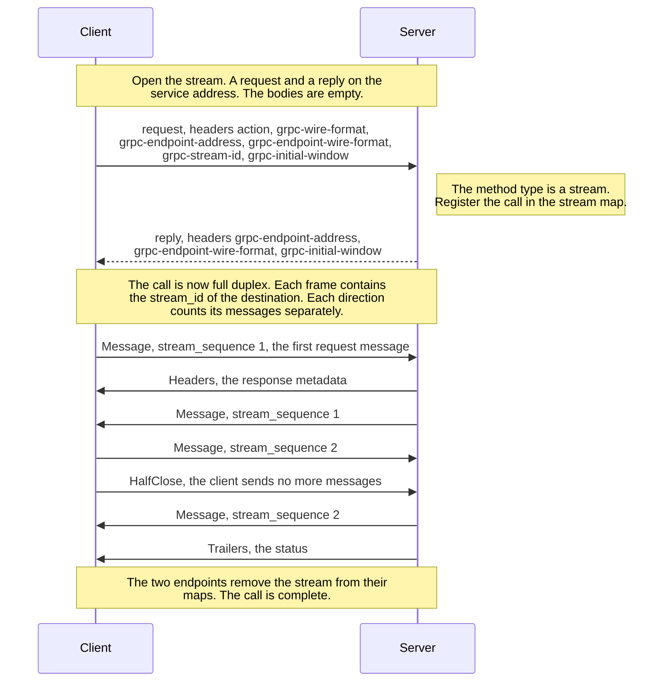

# vertx-grpc-eventbus (experimental)

This module is an experiment. It sends gRPC on the Vert.x event bus and not on HTTP/2.
The work is at an early stage.

The protocol in this document is a proposal. It is not an agreed format. The prototype
does not always agree with each detail. Read this document as a design in progress. Do
not read it as a specification.

The reason for this experiment is as follows. A client and a server can be in the same
Vert.x application or cluster. Then you can use the generated stubs to make gRPC calls on
the event bus that is already there. You do not have to start an HTTP server. The calls
can also move on a clustered event bus, with the other verticles.

## The objective

The application code must stay the same. The generated stubs and the `GrpcServerRequest`,
`GrpcServerResponse` and `GrpcClientRequest` types are the same as for the HTTP/2
transport. Only the factory is different.

```java
// server
EventBusGrpcServer.server(vertx).onSuccess(server -> {
  server.addService(GreeterGrpcService.of(new GreeterService() { ... }));
});

// client
EventBusGrpcClient.client(vertx).onSuccess(client -> {
  GreeterClient greeter = GreeterGrpcClient.create(client);
  greeter.sayHello(HelloRequest.newBuilder().setName("World").build());
});
```

The remainder of this document gives the format of the data on the wire. The event bus is
a message bus and not a byte stream. Therefore gRPC streams need a small protocol on top
of the event bus.

## Types of call

The type of the method selects the part.

### Client Unary calls: a request and a reply

A unary call is one event bus `request()` call and its reply. The request contains these
items:

- The `action` header, which contains the name of the method.
- The `grpc-wire-format` header, which contains the wire format.
- The headers with the `__header__.` prefix, which contain the request metadata.
- The body, which contains the encoded message.

The reply contains the response message. The headers with the `__header__.` and
`__trailer__.` prefixes contain the response metadata and the trailers. A status that is
not `OK` gives no reply. The server fails the event bus message with the gRPC status as
the failure code and the status message as the failure message.

A Vert.x service proxy uses the same format. This is intentional. A unary call and a
service proxy call stay interchangeable on the bus. Therefore unary calls do not change,
and only streams add new items.

### Streams: an upgrade handshake

The event bus does not natively support streaming, instead any kind of streaming requires more than one request and one reply.

To open a stream, the client sends a request and receives a reply, this procedure is very much like an HTTP upgrade.

#### The request of the client

The client sends the first `request()` call to the service address. The headers contain
these items:

- `action`, the name of the method.
- `grpc-wire-format`, the wire format.
- `grpc-endpoint-address`, the private address of the client. Present when any side streams.
- `grpc-endpoint-wire-format`, the wire format of the client endpoint. Present when any
  side streams.
- `grpc-stream-id`, the identifier that the client gives to this call.
- `grpc-initial-window`, the number of messages the client can receive. Present when the
  server streams. The server uses this value as its send credit.
- `grpc-ping-timeout`, the time in milliseconds that the client waits before it declares a
  peer down. Present when the client streams. Refer to [Liveness](#liveness).
- The request metadata, with the `__header__.` prefix.

Depending on the client method type, the request body will differ, when the client

- sends a unique message, the request body is this unique message
- sends a stream of messages, the request body is null

#### The reply of the server

The server does these steps:

1. Find the method.
2. Prepare the call.
3. Register the call.
4. Reply with `grpc-endpoint-address`, `grpc-endpoint-wire-format`, and `grpc-initial-window`.

The reply is only the signal to start. The server sends the reply before the handler
operates. Therefore, the reply contains no response metadata.

When the client sends a unique message as part of the event-bus request, this message is delivered to the
service.

The response body is null.

Otherwise, the call is full duplex: all subsequent data are carried as `TransportFrame` on the private addresses.

#### Private addresses and multiplex operation

After the stream opens, the frames move on the private address of each endpoint. There is
no address for each call.

Each endpoint creates one private address at start. Each endpoint registers one consumer
on this address, and this consumer stays registered. All the streams of the endpoint use
this one consumer.

Each frame contains the `stream_id` value of the destination. The identifier is a 64 long
value that uniquely identifies a stream. The receiver uses a map to demultiplex the frame
to the correct call. The client chooses a stream id for every stream and sent it to the
server.

This behaviour is important on a clustered bus. Each server node registers the service
address. Therefore the first `request()` call goes to one node of the group. The reply
contains the private address of that node. Therefore all subsequent frames of the stream
go to the same node.

The consumer stays registered and is not related to one call. Therefore the endpoint only
adds an entry to a map, or removes an entry from a map, when a stream opens or closes.
There is no register operation and no unregister operation for each call. Such operations
send registration data to each node of the cluster. A stream timeout, when added, will
also be an operation on a map.

#### The end of a stream

The endpoint removes a stream from the map when the stream ends with trailers or with a
`Cancel` frame. The endpoint also stops a stream in these conditions:

- The endpoint cannot deliver a frame.
- The peer of the stream does not answer. Refer to [Liveness](#liveness).

Therefore, a peer that leaves the cluster does not cause a registration to stay in the
map.

The endpoint discards a frame that has a `stream_id` value that is not in the map. This
condition occurs when a frame is still in transit and the endpoint stops the stream.

When you close an endpoint, the endpoint stops the streams that stay open. The endpoint
does not discard these streams without a signal. The endpoint sends a `Cancel` frame for
each stream, and then removes each stream.


```mermaid
sequenceDiagram
    participant C as Client
    participant S as Server

    Note over C,S: Open the stream. A request and a reply on the<br/>service address. The bodies are empty.
    C->>S: request, headers action, grpc-wire-format,<br/>grpc-endpoint-address, grpc-endpoint-wire-format,<br/>grpc-stream-id, grpc-initial-window
    Note right of S: The method type is a stream.<br/>Register the call in the stream map.
    S-->>C: reply, headers grpc-endpoint-address,<br/>grpc-endpoint-wire-format, grpc-initial-window

    Note over C,S: The call is now full duplex. Each frame contains<br/>the stream_id of the destination. Each direction<br/>counts its messages separately.
    C->>S: Message, stream_sequence 1, the first request message
    S->>C: Headers, the response metadata
    S->>C: Message, stream_sequence 1
    C->>S: Message, stream_sequence 2
    C->>S: HalfClose, the client sends no more messages
    S->>C: Message, stream_sequence 2
    S->>C: Trailers, the status
    Note over C,S: The two endpoints remove the stream from their<br/>maps. The call is complete.
```

#### The sequence of the handshake

Each endpoint registers its consumer when it starts. The factory gives the client or the
server only after this registration is complete. Therefore the private address of an
endpoint always has a consumer when the handshake begins.

Both sides exchange their inbound window in the handshake itself. The client sends
`grpc-initial-window` in the request when the server streams, and the server sends
`grpc-initial-window` in the reply when the client streams. Each side uses the window of
the peer as its send credit. Therefore neither side starts at zero and no initial
`WindowUpdate` frame is necessary.

## Frames

Each item of data after the handshake is a `TransportFrame` object. The wire format of the
call gives the format of the frame. The default format is protobuf binary. In JSON mode,
the format is JSON. The frame is the body of the event bus message. The
`grpc-wire-format` header of the frame gives the format. Therefore the receiver knows how
to read the frame.

A frame contains a small header and one variant. The header contains the `stream_id` and
`stream_sequence` values. The variant is one of these items:

- `Message`, a payload.
- `WindowUpdate`, a flow control credit.
- `HalfClose`, from the client.
- `Headers` or `Trailers`, from the server.
- `Cancel`, from the client or from the server.
- `Ping`, a liveness probe, from the client or from the server.

A `Ping` frame is not related to a call. Therefore, it has the `stream_id` value 0. The
endpoint processes this frame and does not send it to a stream. The `grpc-endpoint-address`
header of the frame contains the private address of the sender. The receiver uses this
address to send the ack, and to give the credit to the correct peer.

The `Headers` and `Trailers` frames contain almost no data. The delivery headers with the
`__header__.` and `__trailer__.` prefixes contain the metadata. These two frames give
only the position of the metadata in the stream. The `Trailers` frame also contains the
gRPC `status` value, because a response stream must end with a status.

The full schema is in
[`eventbus_transport.proto`](src/main/proto/io/vertx/grpc/eventbus/transport/v1alpha/eventbus_transport.proto):

The transport does not encode the messages again. The gRPC encoder makes the bytes. The
`Message.payload` field contains these bytes without a change. The receiver sends the
bytes to the decoder. There is no second codec.

The frame itself uses the wire format of the call. In protobuf mode, the frame is binary.
In JSON mode, the frame is JSON text. Therefore you can read the frame on the bus.
This behaviour is useful with an event bus interceptor. For example, you can examine the
frames. You can also discard one frame and examine the result.

The payload in a JSON frame stays as the message bytes. The frame contains these bytes as
base64 data. The transport does not encode them again.

The encoder and the decoder do not control all of the gRPC data. The delivery headers of
the event bus contain this data. The map is the same for unary calls and for streams:

- `action` contains the method.
- The headers with the `__header__.` and `__trailer__.` prefixes contain the metadata.
- `grpc-wire-format` contains the wire format.

The frame protobuf contains only the data that streams add.

## Configuration

The server and the client accept an options object. These objects are not necessary. The
default values are satisfactory.

```java
EventBusGrpcServer.server(vertx, new EventBusGrpcServerOptions()
  .setSupportedWireFormats(Collections.singleton(WireFormat.PROTOBUF)));

EventBusGrpcClient.client(vertx, new EventBusGrpcClientOptions()
  .setWireFormat(WireFormat.JSON)
  .setPingInterval(Duration.ofSeconds(30)));
```

- `supportedWireFormats` (server, default `[PROTOBUF, JSON]`) gives the wire formats that
  the server accepts. The server rejects a request that has a different format. The status
  is `UNIMPLEMENTED`.
- `wireFormat` (client, default `PROTOBUF`) gives the default wire format for the requests
  of the client. A call can change this format with the `request.format(...)` method. The
  `create(client, WireFormat.JSON)` method of the generated stub does the same. The value
  of the call has priority.
- `initialWindowSize` (client and server, `int`, default 64) gives the number of messages
  that the endpoint can receive before the sender must wait for a `WindowUpdate` frame.
  Each side sends this value in the handshake, and the peer uses it as its send credit.
- `pingInterval` (client, `Duration`, default 30 seconds) gives the interval between the
  probes. The client sends a probe to each server endpoint that holds one of its streams.
  Refer to [Liveness](#liveness).
- `pingTimeout` (client, `Duration`, default 60 seconds) gives the maximum time that a
  server can take to answer a probe. After this time, the client stops each stream with
  that server. This value must be more than `pingInterval`. The factory of the client
  rejects a value that is not more, because the client would then stop the streams before
  the server can answer.
- `maxPingTimeout` (server, `Duration`, default 2 minutes) gives the maximum ping timeout
  that the server accepts. The client sends its own timeout, and the server holds the
  client to that same value. Both sides then stop a stream at the same time. Therefore the
  server has no option that must agree with an option of the client. This option only
  limits the time that a client can ask the server to wait.
- `cleanerPeriod` (client and server, `Duration`, default 5 milliseconds) gives the period
  at which the endpoint checks remote endpoints for liveness. At each tick, the endpoint
  sends pings that are due and reaps remote endpoints that have gone silent.

You cannot set the ping options to zero. The event bus gives no connection, and the
probe replaces the connection. Therefore the probe is always in operation. Refer to
[Liveness](#liveness).

## Flow control

The `send()` method does not wait for a reply. It returns immediately. It does not tell
you if the other endpoint can receive more data. Therefore there is no automatic
backpressure. The design has its own window, and this window counts messages and not
bytes.

The window is equivalent to the HTTP/2 `WINDOW_UPDATE` mechanism (RFC 7540, section 6.9),
but at message level. Both sides exchange their inbound window in the handshake. The client
sends `grpc-initial-window` in the request when the server streams, and the server sends
`grpc-initial-window` in the reply when the client streams. Each side uses the window of
the peer as its send credit. The endpoint uses one credit for each `Message` frame that it
sends. At zero credits, the endpoint stops.

The application of the receiver reads the messages. Then the receiver sends a
`WindowUpdate` frame with a delta value. The sender adds this delta to its window.

The Vert.x `WriteStream` interface shows this behaviour:

- A window of zero makes the `writeQueueFull()` method return true.
- A `WindowUpdate` frame starts the `drainHandler` handler.

Therefore a generated `Pipe` object, or a different correct producer, operates as on
HTTP/2.

A producer can ignore the `writeQueueFull()` method. A loop of `response.write(...)` calls
is an example. This condition must be safe. At zero credits, the stream keeps the
additional messages in a buffer. The stream holds the last frame until the buffer is
empty. Therefore no message is lost, and the sequence of the messages does not change.

On a local event bus, the window gives correct backpressure. Without the window, a
consumer in the pause condition keeps the messages in a buffer and can then discard them.
On a clustered event bus, the window is the only backpressure. A `send()` call puts the
message on the wire immediately.

## Liveness

HTTP/2 uses TCP to find a peer that stopped. The event bus has no equivalent connection.
Therefore the design finds an unavailable peer in two ways. In both conditions, the
endpoint stops the stream. The endpoint does not try again, because a second attempt can
conflict with the stop procedure.

### Method 1: a delivery failure

Each endpoint sends the frames to the private address of the peer. A point-to-point
`send()` call fails with `NO_HANDLERS` when that address has no consumer.

When a frame does not go to the peer, the sender stops the stream. The sender does these
steps:

1. Fail the read side and the writes that are in the queue. The application then knows
   the condition.
2. Remove the stream from the map. No data then stays in the map.

The application receives this failure immediately. To examine this behaviour, use an
outbound interceptor that removes the consumer of the peer.

### Method 2: a ping probe

Method 1 operates only when an endpoint sends a frame. An endpoint that only receives
data does not send a frame. Therefore the design also uses a probe.

The client sends a `Ping` frame to each peer at a regular interval. The peer sends the
same frame back with the `ack` flag set.

The two endpoints use the probe as follows:

- The client receives no ack in the `pingTimeout` period. The client then declares that
  the peer stopped.
- The server receives no probe in the timeout that the client sent in the handshake, or in
  `maxPingTimeout` when the client sends a larger timeout or sends none. The server then
  declares that the peer stopped.

The two sides use the same period. A delay that one side accepts therefore does not stop
the stream on the other side.

In both conditions, the endpoint stops each stream of that peer. The endpoint also sends
a `Cancel` frame on each of these streams. The peer can be unavailable but not stopped.
Then the peer keeps the streams, because it receives no other data about them.

A probe is also a `send()` call. Therefore the probe is also a delivery check on a peer to
which the client sends no data.

### The scope of a probe

The endpoint keeps the probe data for each peer address. The endpoint does not keep probe
data for each stream.

A probe shows that the peer endpoint is available. This is one item of data for all the
streams of that peer. Therefore more streams to the same server do not increase the
quantity of probes.

A probe does not find one call that stopped when its endpoint is available. The deadline
of the call finds this condition.

### Configuration of the probe

Only the client sends probes. The client sends its timeout in the handshake that opens the
stream, and the server holds the client to that same timeout. The server needs no option
that must agree with the client.

A client can send no timeout, or a timeout that is more than the server accepts. The
server then uses the `maxPingTimeout` value. Therefore each peer has a limit, and no peer
can stop without an indication.

The client continues to send probes after it closes the request side of the call.
Liveness is not related to the request side.

The probe is always in operation. You cannot set it to `0` on the client or on the
server. Without the probe, an endpoint that receives no data cannot find the difference
between these two conditions:

- The peer is available but sends no data.
- The peer stopped.

The stream then stays open, and its registration stays in the map. The stream does not
fail.

You can change the rate of the probes. Keep the `pingTimeout` value at a small multiple of
the `pingInterval` value. One late ack then does not stop a stream that is in operation.

A unary call does not use the probe. A unary call is only a request and a reply.

### Backpressure and the shared consumer

All the streams of an endpoint use one consumer. Therefore the window of each stream is
the only backpressure.

The endpoint never puts this consumer in the pause condition. A pause stops all the
streams behind one slow stream. This condition is head-of-line blocking.

A slow reader keeps the `WindowUpdate` credit of its own stream. At the same time, the
shared consumer continues to read the data of the other streams.

## Open questions and future work

This module is an experiment. Some functions are not in the current scope. This is the
direction for each function.

- **Session identity and resumption.** The endpoint multiplexes the streams on one
  consumer that stays registered, and the `stream_id` value identifies each stream.
  Therefore there is no registration data for each call. The private address is also the
  session token of the endpoint. The endpoint creates this address for each process, and
  the address stops with the process. Therefore an endpoint that starts again has a new
  address, and old frames go to an address that has no consumer. A different, permanent
  `session_id` value is necessary only for two functions: to connect the streams after a
  new connection, and for flow control at session level. This work is deferred.
- **Flow control at session level.** HTTP/2 has a second window for the full connection,
  in addition to the window of each stream. Therefore a connection can limit the total
  quantity of data in its buffers. The equivalent function is a window for all the streams
  that use one private address. This function needs the `session_id` value above.
- **Resumption.** Each `Message` frame contains a `stream_sequence` value. This value
  permits a future function. A client that loses its connection can connect again. The
  client can then ask the server to send again all the messages after the last sequence
  value that it received. The MCP `Last-Event-ID` function has the same purpose. Two items
  are necessary: a handshake for the new connection, and a replay buffer with a limit. To
  continue after a node failure, and not only after a lost connection, the session data
  must be in a shared or permanent store. This store can be an SPI with a local default
  and, for example, a Redis backend.

## References

- RFC 7540, Hypertext Transfer Protocol Version 2 (HTTP/2), sections 5.2 and 6.9. These
  sections give flow control and the `WINDOW_UPDATE` frame. This is the model for the
  window in this design, which counts messages. RFC 9113 replaces RFC 7540 and keeps the
  same flow control.
- gRPC on HTTP/2, the gRPC wire protocol. This design follows that protocol at call level:
  <https://github.com/grpc/grpc/blob/master/doc/PROTOCOL-HTTP2.md>
- Model Context Protocol, Streamable HTTP transport. This is the source of the session and
  `Last-Event-ID` ideas in the section above:
  <https://modelcontextprotocol.io/specification>
- Reactive Streams, the model that uses `request(n)` to signal demand. The Vert.x
  `ReadStream.fetch` method and this window both follow that model:
  <https://www.reactive-streams.org/>
- RSocket, a protocol for messages. Its `REQUEST_N` frame is comparable prior art for flow
  control that counts messages: <https://rsocket.io/about/protocol>
